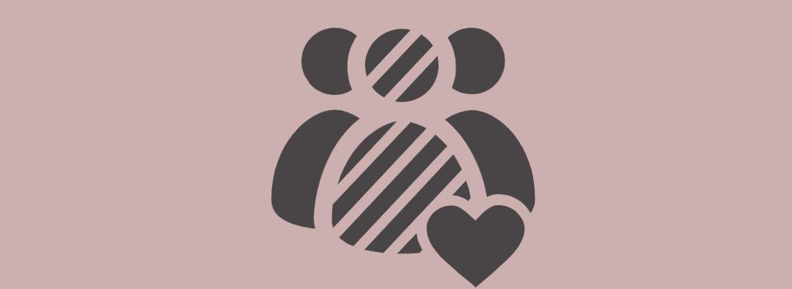
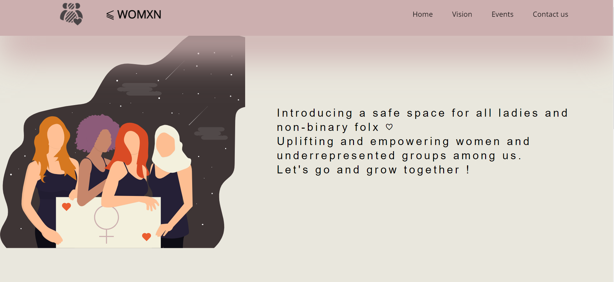

# HackgirlSummer 2.0 By MLH 🥳

Hackgirl summer is a 3-day Hackathon focused on women and non-binary people  
with an open theme of gender equity and inclusion

## Team Members 
<li>Shivanshi Saxena</li>
<li>Charvi Khanna</li>
<li>Jigyasa Nagpal</li>

## Details 
We had an idea and we thrived upon it with our knowledge of semantic HTML5, CSS3 and Flexbox .
We used the designing tool Figma and with the help of google forms we managed to complete our 'Contact Us' section. 
Just a little time management, teamwork and coordination led to completion of this beautiful project.

## The Look and Feel

## Nitty Gritty
This was the first hackathon me and my friends participated in!  
Thanks to the constant support, fun events and encouragment by MLH, we had a fun weekend! 🎇  
